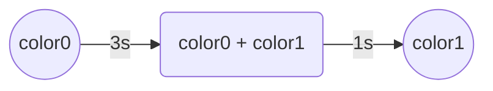

# 0x01

# embassy-rs: GPIO, PWM & Async Dev

1. Connect a **green** LED to _GP4_ and a **red** LED to _GP5_. Blink the LEDs consecutively, for 1 second each
(i.e. when one LED is on, the other is off).

2.
    - Connect the **RGB** LED to _GP0_, _GP1_, and _GP2_. Write a program that increases the LED's
    intensity with 10% each second. 
    - Using the previous code as a starting point, write a program that increases the LED's intensity with 10%,
    each time the _button A_ is pressed, and decreases it with 10% each time _button B_ is pressed.

:::note
Check the **How to wire an RGB Led** section of the [PWM course](../courses/pwm).
:::

3. Choose **three** colors of your liking from this [color wheel](https://www.figma.com/color-wheel/).
Using the RGB representation of each color, write a program that switches `color0` -> `color1` -> `color2`
every time the **switch A** is pressed.

### Mini Mood LED

Write a program that controls the RGB LED using the the four buttons on the
Pico Explorer, like so:
    - **Switch A:** LED = `color0`
    - **Switch B:** LED = `color1`
    - **Switch X:** LED = `color2`
    - **Switch Y:** LED = `groove mode`

:::info
**`groove mode`** means that the colors will be displayed sequentially for 3 seconds each, with a gradual transition period of 1 second.

:::

:::tip
Use separate tasks for each button. When a button press is detected, a command will be sent to the
main task through a shared channel, and the main task will set the RGB LED's color according to that command.
:::

